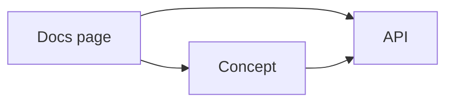

# Diagrams

Mermaid is the default. Reasons: GitHub native rendering since 2022, Obsidian native, Quartz native, MkDocs Material via `pymdownx.superfences`, mdBook via `mdbook-mermaid`, Docusaurus native. Single source format covers every consumer that matters.

## Embedding

Inline in any markdown file via a fenced block tagged `mermaid`:

````

````

## Standalone diagram files

Per-topic graph artefacts live in `40-graphs/` and are always produced in **both** Mermaid and JSON:

- `sitemap.mmd` — Mermaid source for the URL-level link graph.
- `sitemap.json` — `{ "nodes": [...], "edges": [...] }` for programmatic consumption.
- `knowledge.mmd` — Mermaid source for the concept / API / tool / entity graph.
- `knowledge.json` — same JSON shape.

The JSON shape:

```json
{
  "graph_kind": "sitemap",
  "nodes": [
    { "id": "src_…", "title": "Getting started", "url": "https://…", "type": "source" }
  ],
  "edges": [
    { "from": "src_…", "to": "src_…", "kind": "links_to" }
  ]
}
```

`kind` values draw from [TAXONOMY/relation-types.md](../TAXONOMY/relation-types.md).

## Diagram types

| diagram | use |
|---|---|
| `flowchart` | most graphs — sitemap, KG views, pipeline flow |
| `graph` | alias for `flowchart`, accepted but `flowchart` is preferred |
| `sequenceDiagram` | API call sequences, control flow between services |
| `classDiagram` | type / trait / interface relationships |
| `erDiagram` | data-model relationships |
| `stateDiagram-v2` | state machines, lifecycle diagrams |
| `gantt` | timelines |
| `timeline` | research timelines, release histories |
| `mindmap` | concept brainstorms (synthesis only — not source-of-truth) |
| `gitGraph` | branch histories |
| `journey` | user / agent journey |

## When Mermaid is not enough

- **D2**: allowed for diagrams where Mermaid's layout collapses (large graphs, nested containers). Always commit the `.d2` source and a rendered `.svg` next to it. Embed the SVG in markdown via ``.
- **PlantUML**: same rule — `.puml` source and rendered `.svg`.
- **Excalidraw / tldraw**: hand-drawn diagrams allowed in synthesis docs. Always export as `.svg` and commit alongside the source file (`.excalidraw`, `.tldr`).

## Rendering edge cases

- Mermaid theme support varies. Do not rely on theme directives (`%%{init:…}%%`) for semantic meaning — use node labels.
- Long node labels wrap inconsistently across renderers. Keep labels under 40 characters; put detail in the linked doc, not the diagram.
- Sub-graphs (`subgraph`) work on all major renderers but the styling differs. Use them for grouping when grouping is part of the meaning, not for cosmetics.
