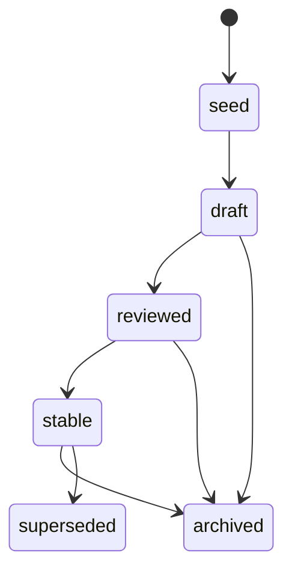

# Status and Confidence

Two orthogonal axes. Status describes the document's lifecycle position. Confidence describes how much weight the claims in the document carry.

## Status

| value | meaning |
|---|---|
| `seed` | captured but not structured. Body may be empty or sparse. Acceptable to have no `confidence`. |
| `draft` | body written, not reviewed. Indexes may include drafts but should annotate them. |
| `reviewed` | read end-to-end, claims checked against sources. |
| `stable` | accepted into the corpus. Linked from indexes. The canonical state. |
| `archived` | historical. Not deleted. Not actively maintained. |
| `superseded` | replaced. `superseded_by:` points to the replacement. |

Transitions:

## Confidence

| value | meaning |
|---|---|
| `low` | speculation or inference from sparse evidence. Always tagged with `inferred`. |
| `medium` | supported by some sources but not corroborated across multiple. |
| `high` | corroborated by canonical sources (the project's own docs, source code, RFC, spec). |
| `verified` | corroborated **and** re-checked against live state — CLI lookup, source-code read in the same session, executable example. |

Confidence is required on:

- Every `extract:*` doc.
- Every `synthesis` doc.
- Every `conclusion` doc.

Confidence is optional on:

- `source` docs — the source is the citation, the confidence is implicit in its source-type.
- `topic`, `convention`, `taxonomy`, `index` docs — they are structural.

## Why both axes

A `stable` doc can carry `confidence: low` claims if those claims are tagged as such inline. A `draft` doc can carry `confidence: verified` claims for the parts already checked. Conflating the two — "is this finished" with "is this true" — loses information.
