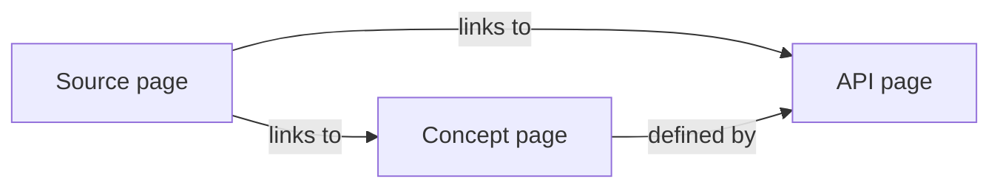

# Research Standard

This file is the canonical spec. Everything in `Research/` conforms to it; if a file does not, it is either non-research (build artefacts, drafts marked `status: seed`) or it is wrong.

## Design goals

The standard is designed so that:

1. A markdown renderer with full GFM plus common extensions can render every file without losing meaning — GitHub, Obsidian, Foam, Quartz, MkDocs Material, mdBook, Docusaurus, Pandoc.
2. An agent grepping or AST-parsing the tree can identify any node by its frontmatter `id`, traverse to its neighbours via wiki-style `[[id]]` links and frontmatter `related:` lists, and answer "what is the provenance of this claim" via `sources:`.
3. Diagrams, math, footnotes, callouts, and tables are available at every level — diagrams via Mermaid first, math via KaTeX-compatible LaTeX, callouts via the GFM `> [!note]` form.
4. The directory layout mirrors the research lifecycle: question → sources → extracts → graphs → synthesis → decision → conclusion.

## Top-level layout

```
Research/
├── README.md
├── RESEARCH-STANDARD.md
├── CONVENTIONS/
├── TAXONOMY/
├── INDEX/
├── topics/<topic-slug>/
└── pipelines/
```

Each subtree has a single responsibility:

- **CONVENTIONS/** — how things are written and linked (this file plus seven companions).
- **TAXONOMY/** — the controlled vocabularies that frontmatter `type:`, `concept_type:`, `relation_type:`, and `source_type:` values draw from.
- **INDEX/** — linking tables. One row per registered entity. Indexes are the only files in the tree that may be (and should be) regenerable from frontmatter.
- **topics/** — research topics. One topic = one directory. Topics own their sources, extracts, graphs, syntheses, decisions, and conclusions.
- **pipelines/** — reusable, agent-executable specs for the moves we do over and over (scrape a site, build a sitemap graph, extract a KG from raw markdown).

## Topic layout

A topic directory uses ordered numeric prefixes so filename-sorted listings present the research lifecycle in order:

```
topics/<topic-slug>/
├── README.md                # Topic landing
├── 00-overview.md           # What is this topic, why, scope, non-goals
├── 10-questions.md          # Driving questions, each with an id and status
├── 20-sources/              # Captured raw material
│   ├── _manifest.md         # Linking table of sources for this topic
│   └── <source-id>/
│       ├── _meta.md         # Provenance (url, retrieved_at, hash, mime, crawler, depth)
│       └── content.md       # Cleaned markdown content
├── 30-extracts/             # Structured nodes parsed from sources
│   ├── concepts/<id>.md
│   ├── apis/<id>.md
│   ├── tools/<id>.md
│   └── entities/<id>.md
├── 40-graphs/               # Graph artefacts
│   ├── sitemap.mmd          # Mermaid sitemap (URL → URL)
│   ├── sitemap.json         # Sitemap as nodes/edges
│   ├── knowledge.mmd        # Mermaid KG (concept → concept, api → tool, etc.)
│   └── knowledge.json
├── 50-syntheses/            # Distilled views, Maps Of Content, walkthroughs
├── 60-decisions/            # ADR-style decision records (one decision per file)
└── 90-conclusions.md        # Final findings, with confidence grades
```

The numeric prefixes are stable. Stages `20-/30-/40-/50-` may grow many files; stages `00/10/60/90` are usually single files per topic.

## Frontmatter

Every markdown file has YAML frontmatter at the top. See [CONVENTIONS/frontmatter-schema.md](./CONVENTIONS/frontmatter-schema.md) for the full schema and per-type extensions. The universal keys are:

| key | required | type | notes |
|---|---|---|---|
| `id` | yes | string | Canonical identifier. For high-volume artefacts: ULID prefixed by type (`cpt_…`, `src_…`, `api_…`). For everything else: kebab-slug. |
| `title` | yes | string | Human-readable title. |
| `type` | yes | enum | Drawn from the type taxonomy. See [TAXONOMY/concept-types.md](./TAXONOMY/concept-types.md). |
| `status` | yes | enum | `seed \| draft \| reviewed \| stable \| archived \| superseded`. |
| `confidence` | no | enum | `low \| medium \| high \| verified`. Required on synthesis / conclusion / extract docs. |
| `created` | yes | ISO 8601 date | Authoring date. |
| `updated` | yes | ISO 8601 date | Last meaningful change. |
| `tags` | no | list[slug] | Free-form classification. |
| `related` | no | list[id] | Machine-readable cross-references (parallel to inline `[[id]]`). |
| `sources` | no | list[id] | Provenance — source-ids backing claims in this doc. |
| `supersedes` | no | list[id] | Other docs this one replaces. |
| `superseded_by` | no | list[id] | Set when this doc becomes obsolete. |

Type-specific keys (e.g. `url`, `retrieved_at`, `content_hash` for sources; `concept_type`, `aliases` for concept extracts; `signature`, `module_path`, `api_kind` for API extracts) are defined in the schema file.

## Linking

Two parallel forms — inline wikilinks and frontmatter lists:

- **Inline wikilinks**: `[[id]]` or `[[id|display text]]`. Wikilinks render natively in Obsidian, Foam, Quartz, Logseq. On strict GFM renderers (GitHub) they appear as bracketed text; an agent or a Quartz-style transform resolves them.
- **Standard relative links** for renderer-strict targets: `[Frontmatter schema](./CONVENTIONS/frontmatter-schema.md)`.
- **Frontmatter `related:` and `sources:`** carry the machine-readable parallel. Indexes and the graph extractors read these first, the inline `[[id]]` second.

The rule: every cross-reference appears in **both** forms — frontmatter for machines, inline for readers. Indexes are regenerable purely from frontmatter.

See [CONVENTIONS/linking-tables.md](./CONVENTIONS/linking-tables.md) for the linking-table format.

## Identifiers

- **Slugs** are kebab-case ASCII, used for topic directories, filenames, and tag values.
- **ULIDs** are used for high-volume artefacts where slug collisions are likely — concepts, API entries, sources, individual graph nodes. Format: `<type>_<26-char ULID>`, e.g. `cpt_01HZX…`, `src_01HZY…`, `api_01HZZ…`.
- The frontmatter `id` is canonical. The filename is derived from `id` (verbatim for ULID-prefixed ids, slug for others).

See [CONVENTIONS/ids-and-slugs.md](./CONVENTIONS/ids-and-slugs.md).

## Diagrams

Mermaid is the default — broadest renderer support (GitHub native since 2022, Obsidian native, Quartz native, MkDocs Material with `pymdownx.superfences`, mdBook with `mdbook-mermaid`, Docusaurus native).



D2 and PlantUML are allowed but always shipped alongside a rendered SVG so renderers without the plugin still see the diagram.

Sitemap and knowledge-graph artefacts are produced in **both** forms:
- `sitemap.mmd` / `knowledge.mmd` — Mermaid for visual rendering.
- `sitemap.json` / `knowledge.json` — `{ "nodes": [...], "edges": [...] }` for programmatic consumption.

See [CONVENTIONS/diagrams.md](./CONVENTIONS/diagrams.md).

## Math

KaTeX-compatible LaTeX. Inline math `$E = mc^2$`. Block math `$$ … $$`. GitHub renders since 2022; Obsidian, Quartz, MkDocs Material, mdBook, Docusaurus all support with default or one-line config.

See [CONVENTIONS/math.md](./CONVENTIONS/math.md).

## Callouts and admonitions

GFM callout form `> [!note]` is the default — native on GitHub since 2023 and on Obsidian. The recognised tags are `note`, `tip`, `important`, `warning`, `caution`. For MkDocs Material the same content is recognised via its admonition extension; the GFM form is the lowest common denominator.

See [CONVENTIONS/admonitions.md](./CONVENTIONS/admonitions.md).

## Fonts, themes, plugins

Output-side concerns. The content itself stays portable — no renderer-specific extensions baked into source files. When a topic is published to a specific renderer (Quartz site, MkDocs site, Docusaurus), per-renderer config lives in a separate sibling directory, never in the topic content.

## Status lifecycle

- `seed` — captured but not yet structured. Acceptable to have no body.
- `draft` — body written, not reviewed.
- `reviewed` — read end-to-end, claims checked against sources.
- `stable` — accepted into the corpus. Linked from indexes.
- `archived` — historical; not deleted, not actively maintained.
- `superseded` — replaced. `superseded_by:` points to the replacement.

Confidence is orthogonal to status and applies to claim-bearing docs:

- `low` — speculation or inference from sparse evidence.
- `medium` — supported by some sources but not corroborated across them.
- `high` — corroborated by canonical sources.
- `verified` — corroborated and re-checked against live state (e.g. CLI lookup, source-code read).

See [CONVENTIONS/status-and-confidence.md](./CONVENTIONS/status-and-confidence.md).

## Provenance

Every claim in an extract, synthesis, or conclusion must trace to one or more entries in `sources:`. Source files in `20-sources/` are the only places that hold un-cited content — they are the citations themselves.

An extract that cannot cite a source must be marked `confidence: low` and tagged `inferred`.

## Linking tables

Indexes in `INDEX/` are markdown tables with frontmatter, regenerable from the rest of the tree. Per-topic source manifests in `20-sources/_manifest.md` follow the same shape. See [CONVENTIONS/linking-tables.md](./CONVENTIONS/linking-tables.md) for column conventions per index type.

## Pipelines

Pipeline specs in `pipelines/` are reusable how-tos for the moves the research repeatedly performs. They are written so an agent can execute them end-to-end. Each pipeline has:

- A frontmatter block declaring inputs, outputs, and the artefacts it produces.
- A step-by-step procedure.
- A verification checklist.
- A worked-example reference to a topic where it has been executed.

The starting set of pipelines is:

- [[scrape-firecrawl]] — capture a docs site via Firecrawl, persist per-page markdown plus link metadata.
- [[sitemap-graph]] — build the sitemap graph from the captured corpus.
- [[extract-knowledge-graph]] — extract concepts / APIs / tools / entities from the captured markdown and emit the KG.

## What this standard deliberately does not specify

- Which renderer to publish to. The standard is portable; publishing is a separate concern.
- Visual styling. No CSS, no theme tokens. Output-side.
- Auto-generated indexes. Indexes can be regenerated by tooling, but the source of truth is per-file frontmatter — tooling is a convenience, not a requirement.
