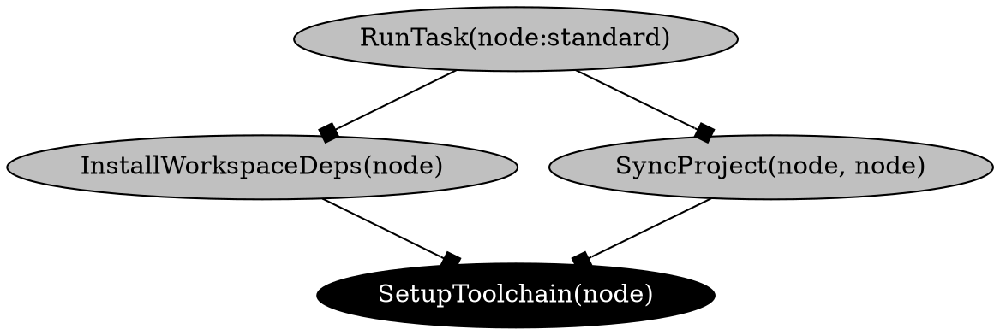

[Skip to main content](https://moonrepo.dev/docs/commands/action-graph#__docusaurus_skipToContent_fallback)

info

Documentation is currently for [moon v2](https://moonrepo.dev/blog/moon-v2.0) and latest proto. Documentation for moon v1 has been frozen and can be [found here](https://moonrepo.github.io/website-v1/).

On this page

v1.15.0

The `moon action-graph [target]` (or `moon ag`) command will generate and serve a visual graph of
all actions and tasks within the workspace, known as the
[action graph](https://moonrepo.dev/docs/how-it-works/action-graph). In other tools, this is sometimes referred to as a
dependency graph or task graph.

```shell
# Run the visualizer locally
$ moon action-graph

# Export to DOT format
$ moon action-graph --dot > graph.dot
```

> A target can be passed to focus the graph, including dependencies _and_ dependents. For example,
> `moon action-graph app:build`.

### Arguments [​](https://moonrepo.dev/docs/commands/action-graph\#arguments "Direct link to Arguments")

- `[target]` \- Optional target to focus.

### Options [​](https://moonrepo.dev/docs/commands/action-graph\#options "Direct link to Options")

- `--dependents` \- Include dependents of the focused target.
- `--dot` \- Print the graph in DOT format.
- `--host` \- The host address. Defaults to `127.0.0.1`. v1.36.0
- `--json` \- Print the graph in JSON format.
- `--port` \- The port to bind to. Defaults to a random port. v1.36.0

### Configuration [​](https://moonrepo.dev/docs/commands/action-graph\#configuration "Direct link to Configuration")

- [`pipeline`](https://moonrepo.dev/docs/config/workspace#pipeline) in `.moon/workspace.*`
- [`tasks`](https://moonrepo.dev/docs/config/tasks#tasks) in `.moon/tasks/*`
- [`tasks`](https://moonrepo.dev/docs/config/project#tasks) in `moon.*`

## Example output [​](https://moonrepo.dev/docs/commands/action-graph\#example-output "Direct link to Example output")

The following output is an example of the graph in DOT format.



- [Arguments](https://moonrepo.dev/docs/commands/action-graph#arguments)
- [Options](https://moonrepo.dev/docs/commands/action-graph#options)
- [Configuration](https://moonrepo.dev/docs/commands/action-graph#configuration)
- [Example output](https://moonrepo.dev/docs/commands/action-graph#example-output)