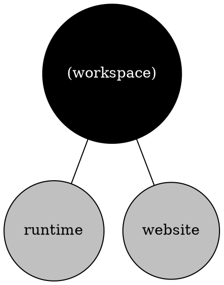

[Skip to main content](https://moonrepo.dev/docs/commands/project-graph#__docusaurus_skipToContent_fallback)

info

Documentation is currently for [moon v2](https://moonrepo.dev/blog/moon-v2.0) and latest proto. Documentation for moon v1 has been frozen and can be [found here](https://moonrepo.github.io/website-v1/).

On this page

The `moon project-graph [id]` (or `moon pg`) command will generate and serve a visual graph of all
configured projects as nodes, with dependencies between as edges, and can also output the graph in
[Graphviz DOT format](https://graphviz.org/doc/info/lang.html).

```shell
# Run the visualizer locally
$ moon project-graph

# Export to DOT format
$ moon project-graph --dot > graph.dot

# Focus a specific project
$ moon project-graph app
```

### Arguments [​](https://moonrepo.dev/docs/commands/project-graph\#arguments "Direct link to Arguments")

- `[id]` \- Optional ID or alias of a project to focus, as defined in
[`projects`](https://moonrepo.dev/docs/config/workspace#projects).

### Options [​](https://moonrepo.dev/docs/commands/project-graph\#options "Direct link to Options")

- `--dependents` \- Include direct dependents of the focused project.
- `--dot` \- Print the graph in DOT format.
- `--host` \- The host address. Defaults to `127.0.0.1`. v1.36.0
- `--json` \- Print the graph in JSON format.
- `--port` \- The port to bind to. Defaults to a random port. v1.36.0

### Configuration [​](https://moonrepo.dev/docs/commands/project-graph\#configuration "Direct link to Configuration")

- [`projects`](https://moonrepo.dev/docs/config/workspace#projects) in `.moon/workspace.*`

## Example output [​](https://moonrepo.dev/docs/commands/project-graph\#example-output "Direct link to Example output")

The following output is an example of the graph in DOT format.



- [Arguments](https://moonrepo.dev/docs/commands/project-graph#arguments)
- [Options](https://moonrepo.dev/docs/commands/project-graph#options)
- [Configuration](https://moonrepo.dev/docs/commands/project-graph#configuration)
- [Example output](https://moonrepo.dev/docs/commands/project-graph#example-output)