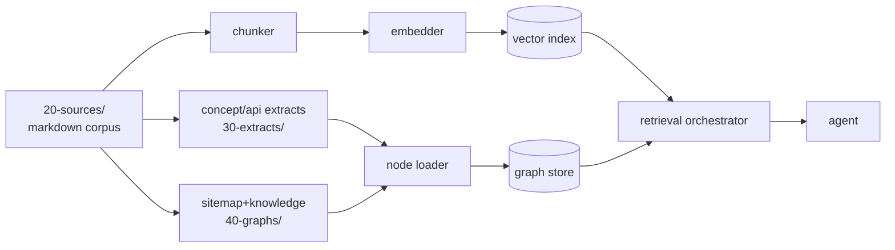

# Overview

## Why this exists

The output of [[docs-knowledge-graph-pipeline]] is a set of files: cleaned markdown sources, structured concept / API / tool / entity extracts, and graph artefacts in JSON and Mermaid. To turn that into something an agent can usefully query at runtime, three layers need to be decided:

1. **Ingestion** — how the files become whatever runtime representation the agent consumes (vectors, graph nodes, full-text index, or a mix).
2. **Storage** — what database(s) hold the representation.
3. **Retrieval** — how the agent asks questions: by similarity, by graph traversal, by structured query, by orchestrated combinations of the above.

The terms in this space have moved unstably. "Graph-RAG" in 2024 meant one thing (Microsoft's published paper); "agentic RAG" in 2025 began meaning multiple things; "knowledge-base RAG" overlaps both. Before recommending an architecture, this topic captures the May 2026 state and decides which names mean which architectures **here**.

## Three retrieval paradigms (working definitions, to be verified)

These working definitions are starting points, not conclusions. Each will be revised against captured sources.

- **Vanilla RAG**: chunk the corpus, embed each chunk, retrieve top-k by similarity to the query embedding, stuff into context. The 2022–2023 baseline.
- **Graph-RAG**: build a knowledge graph over the corpus during ingestion. Retrieve by graph traversal (often combined with vector search to identify entry nodes). The 2024 Microsoft paper popularised the name; the design space is broader than that single paper.
- **Agentic RAG**: the retrieval policy itself is an agent that can iteratively decide what to retrieve next, query the corpus multiple times with refined searches, and choose tools (vector search, graph traversal, structured query, live web fetch). The retrieval becomes an autonomous loop rather than a fixed pipeline.
- **Knowledge-base RAG** / **knowledge-RAG**: often used interchangeably with graph-RAG but sometimes meaning structured-knowledge retrieval over a tabular / triple-store schema instead of an LLM-extracted graph. To be disambiguated.

## Storage option space (working list, to be verified)

| category | representative options (to verify currency) | strengths | weaknesses |
|---|---|---|---|
| dedicated vector DB | Qdrant, Weaviate, Milvus, LanceDB | similarity at scale, mature SDKs | poor at graph traversal |
| graph DB | Neo4j, Memgraph, Kuzu, FalkorDB | traversal, schema, openCypher | embedding workflows often bolt-on |
| hybrid | Surreal, ArangoDB | one store for both | maturity varies, ergonomics vary |
| postgres + extensions | pgvector + Apache AGE / pg_graphql | one operational story | each piece weaker than dedicated |
| sqlite + extensions | sqlite-vss, sqlite-vec | embeddable, no service | scale ceiling |
| LLM-aware frameworks | LightRAG, GraphRAG, HippoRAG | opinionated pipelines | lock-in to that framework's schema |

The names above are working candidates. Each is to be verified for currency and feature set as of May 2026 in `20-sources/` and `30-extracts/`.

## What the file-based corpus gives us upstream

The pipelines in [[docs-knowledge-graph-pipeline]] are deliberately runtime-store-agnostic: they produce markdown files with frontmatter, JSON graphs, and linking tables. Any of the storage options above can ingest from this corpus. The decision about which store(s) to use is therefore deferrable until query patterns are understood — which is the next research move.

## Ingestion shape (to be designed)

Working sketch (to be verified against current practice):

This is the strawman. Open questions about ingestion frequency, schema migrations, embedding refresh, graph-update semantics, and live-vs-frozen sources are listed in [10-questions.md](./10-questions.md).
