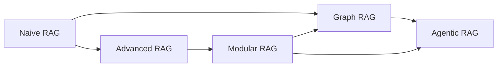

# RAG Taxonomy (May 2026)

Synthesised from ten canonical sources captured 2026-05-16. Every claim cites at least one source by id; ids resolve to `[[src_*]]` entries under `topics/rag-ingestion-graph-stores/20-sources/`.

## The five-paradigm spine

The settled taxonomy in May 2026 is the five-paradigm spine from the [[src_agentic-rag-survey-2025]]: **Naïve RAG → Advanced RAG → Modular RAG → Graph RAG → Agentic RAG**. The other captured sources align with this spine even when they do not enumerate it themselves.

The arrows are evolutionary, not exclusive — production systems compose patterns from multiple paradigms.

## Vanilla RAG (also: Naïve RAG, Naive RAG, NaiveRAG, standard RAG, conventional RAG)

A static, single-shot pipeline: embed the query, retrieve top-k chunks from a vector store (or fetch via keyword retrieval like BM25 / TF-IDF), concatenate into prompt, generate. No iteration, no decision about whether to retrieve, no graph structure.

The name varies — and the variation is itself a finding:

| name | source |
|---|---|
| "Naïve RAG" | [[src_agentic-rag-survey-2025]] |
| "Naive RAG" | [[src_llamaindex-agentic-retrieval-blog]] |
| "NaiveRAG" | [[src_lightrag-repo]] |
| "standard RAG" | [[src_hipporag2-paper]] |
| "conventional RAG baseline" | [[src_graphrag-paper-2024]] |

All five labels denote the same architecture. Treat as synonyms.

Anthropic-side terminology canon: absent. [[src_anthropic-search-results-docs]] mentions RAG only as an acronym expansion in a use-case sentence; Anthropic does not publish a canonical taxonomy page.

## Advanced RAG

Naïve RAG plus semantic understanding. Per [[src_agentic-rag-survey-2025]], the move from sparse retrievers (TF-IDF, BM25) to dense retrievers (Dense Passage Retrieval, neural ranking) and from naive concatenation to re-ranking and query rewriting. Still a fixed pipeline; no agent decisions, no graph.

This category is not used as a noun by [[src_llamaindex-agentic-retrieval-blog]] or [[src_lightrag-paper]] — those treat the move as continuous improvement over Naive RAG rather than a named paradigm. The survey is the source that crystallises the category.

## Modular RAG

Per [[src_agentic-rag-survey-2025]]: decomposition of the retrieval-and-generation pipeline into independent reusable components — separate retriever, re-ranker, query rewriter, output formatter, each swappable. Sets up the substrate that Graph RAG and Agentic RAG variants compose on top of.

## Graph RAG

A family of RAG systems that build a graph index over the corpus during ingestion (typically an entity-and-relation knowledge graph extracted by an LLM) and exploit graph structure at retrieval time — community summarisation, multi-hop traversal, or PageRank-style scoring — for context that flat vector similarity cannot reach.

The settled structural definition is corroborated across:

- [[src_graphrag-paper-2024]] — the original Microsoft paper: two-stage LLM-built graph index plus pregenerated community summaries to answer "global" sensemaking questions.
- [[src_graphrag-repo]] — the canonical Microsoft repo: "modular graph-based RAG system [...] leverages knowledge graph memory structures".
- [[src_lightrag-paper]] and [[src_lightrag-repo]] — positions itself as a lighter graph-RAG variant: dual-level retrieval (low + high) plus graph + vector co-retrieval plus incremental update.
- [[src_hipporag2-paper]] and [[src_hipporag-repo]] — graph-RAG via Personalized PageRank rather than community summaries.
- [[src_agentic-rag-survey-2025]] — survey definition: "extends traditional RAG by integrating graph-based data structures [...] to enhance multi-hop reasoning".

Where the family diverges is on **the specific algorithm**, not the umbrella term: GraphRAG-style community summaries, LightRAG-style dual-level retrieval, HippoRAG-style PageRank are three settled algorithmic instances inside the same paradigm.

Systems analogy for a backend reader: vanilla RAG is a flat LIKE-search index over chunks. Graph-RAG is the same index plus a foreign-key graph extracted at write time, with the retriever doing what amounts to a recursive CTE plus a precomputed materialised view ("community summaries") over the graph.

## Knowledge-RAG / knowledge-base RAG

**Not a settled term.** None of the ten captured sources uses "knowledge-RAG" or "knowledge-base RAG" as a named architectural variant.

The closest cluster of usage:

- [[src_hipporag-repo]] frames its work as "RAG + Knowledge Graphs + Personalized PageRank" — that is, graph-RAG with an explicit knowledge-graph backbone and a long-term-memory metaphor.
- [[src_agentic-rag-survey-2025]] lists "knowledge representation" as one of four axes for classifying Agentic RAG systems but does not name a category "knowledge RAG".

In practice, when a user says "knowledge-base RAG" they usually mean one of:

1. Classic vanilla RAG sitting on top of a curated knowledge base rather than raw documents.
2. Graph-RAG where the graph is specifically a knowledge graph (i.e. entity + relation triples, not arbitrary structure).
3. A memory-augmented RAG system in the HippoRAG style.

**Recommendation**: when a user uses the term, ask which of the three they mean. Do not silently pick one.

> [!important]
> "Knowledge-RAG" / "knowledge-base RAG" has not converged in canon. Phase 2 should capture arXiv:2503.10677 (the "Survey on Knowledge-Oriented RAG") to confirm whether the term is settling or still drifting; that source was not fetched in phase 1.

## Agentic RAG

A RAG architecture in which one or more LLM-driven agents make runtime decisions about the retrieval pipeline itself — whether to retrieve at all, which index or tool to call, how to rewrite the query, how to grade retrieved chunks, whether to iterate.

Backed by:

- [[src_agentic-rag-survey-2025]] — the survey definition: "embedding autonomous AI agents into the RAG pipeline" that "leverage agentic design patterns [of] reflection, planning, tool use, and multi-agent collaboration". Four classification axes: agent cardinality, control structure, autonomy, knowledge representation.
- [[src_langchain-agentic-rag-docs]] — describes the same pattern under the name "retrieval agents": "useful when you want an LLM to make a decision about whether to retrieve context from a vectorstore or respond to the user directly".
- [[src_llamaindex-agentic-retrieval-blog]] — uses "agentic retrieval" as a noun phrase: LLM-based routing across sub-indices plus multi-layer agentic decision-making.

Naming divergence: LangChain's canonical docs use "agentic-rag" only in the URL slug while writing "retrieval agents" in prose. LlamaIndex and the survey use "Agentic RAG" / "agentic retrieval" as nouns. Treat the two as synonymous when reading canon.

Systems analogy: vanilla RAG is a pipeline; agentic RAG is a state machine where the retrieval step is a conditional branch the LLM controls — closer to an event-driven workflow with the LLM as the dispatcher.

## Cross-cutting findings

### Convergence

- **The five-paradigm spine.** Naïve / Advanced / Modular / Graph / Agentic is the spine used by [[src_agentic-rag-survey-2025]] and implicitly aligned with by [[src_graphrag-paper-2024]], [[src_lightrag-paper]], [[src_hipporag2-paper]], [[src_llamaindex-agentic-retrieval-blog]].
- **Naïve / vanilla baseline.** Every source treats flat single-shot vector retrieval as the baseline and labels it consistently in meaning even when the noun differs.
- **Graph-RAG umbrella.** The structural definition (graph index over the corpus, exploited at retrieval time) is settled. The specific algorithm is not — community summaries, dual-level retrieval, Personalized PageRank are three settled instances.

### Divergence

- **"Knowledge-RAG / knowledge-base RAG" has not converged.** No canonical source uses it as a named architectural variant.
- **Agentic-RAG naming.** The concept has converged, the noun has not. "Retrieval agents" (LangChain) and "agentic retrieval" / "Agentic RAG" (LlamaIndex, the survey) denote the same thing.
- **Anthropic absence.** No canonical Anthropic taxonomy page exists in May 2026.

## Implications for this research repo's downstream design

The [[docs-knowledge-graph-pipeline]] output is a structurally explicit knowledge graph extracted from docs corpora. That output naturally maps to a graph-RAG ingestion. Choosing whether to layer agentic retrieval on top is a separate decision; the captured corpus does not constrain it.

Three open implementation questions remain — addressed in phase 2 (database currency) and phase 3 (ingestion conventions):

1. Which graph store to use at runtime (`q-graph-vs-vector` in [[10-questions]]).
2. What chunking and embedding strategy the ingestion uses (`q-ingestion-pipeline`).
3. Where the agentic-retrieval layer's policy lives — in the agent framework, in a separate orchestrator, or fully inside the model's tool-calling loop (`q-agentic-retrieval`).
